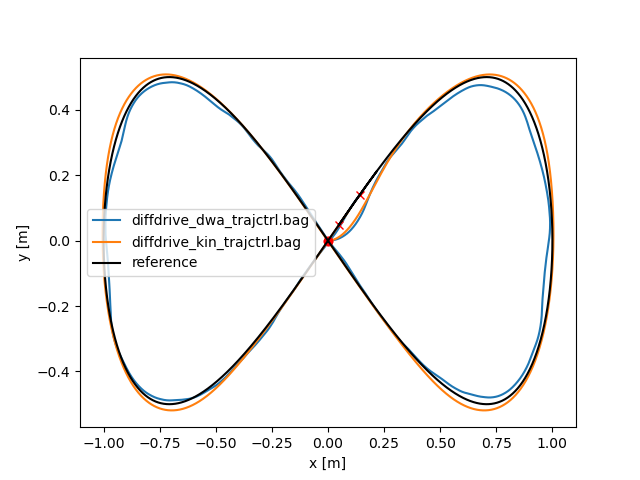
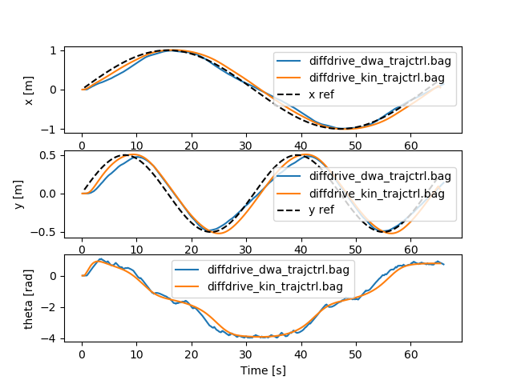
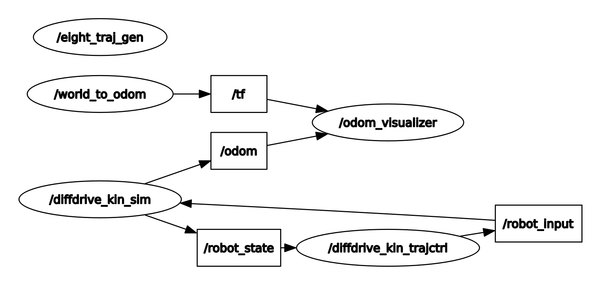
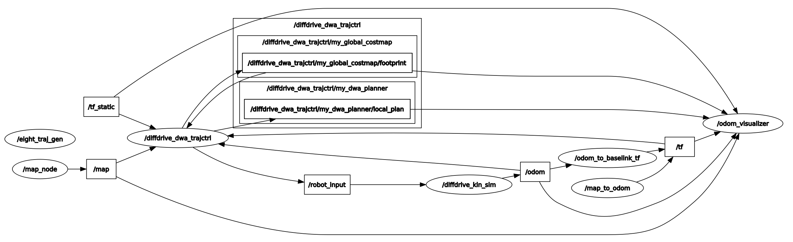

# ROS trajectory tracking controller

Project for the Control of Mobile Robots course at Politecnico di Milano, A.Y. 2021/2022.

## Goal

In this work we first present a comparison between the DWA algorithm from the paper and its ROS implementation ([`dwa_local_planner`](https://wiki.ros.org/dwa_local_planner) package).

Then, a further comparison is made between the implementation above and a custom trajectory tracking controller, which is composed of an inner linearisation law (based on the kinematic model) and an outer tracking law (based on a proportional integral controller with velocity feed-forward).

You can read the [text of the assignment](material/project_assignment.pdf) and a [detailed report](material/report/report.pdf) on the work.
There is also a [set of slides](material/presentation/slides.pdf) briefly summarizing the report above.

## Run instructions

Please refer to the "Usage of the code" section of the [report](material/report/report.pdf), which shows in detail how to run all the code.

## Gallery

Comparison between the two trajectories:

Architecture of the custom controller:

Architecture of DWA standalone:

## Authors

- Leonardo Gargani
- Giuseppe Chiari
- Serena Salvi
